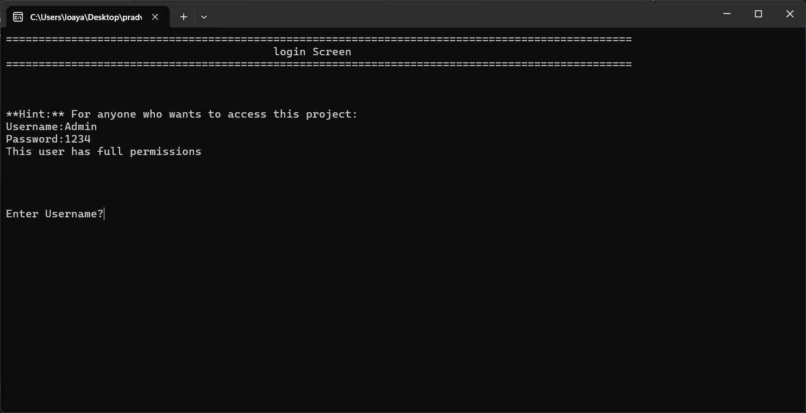
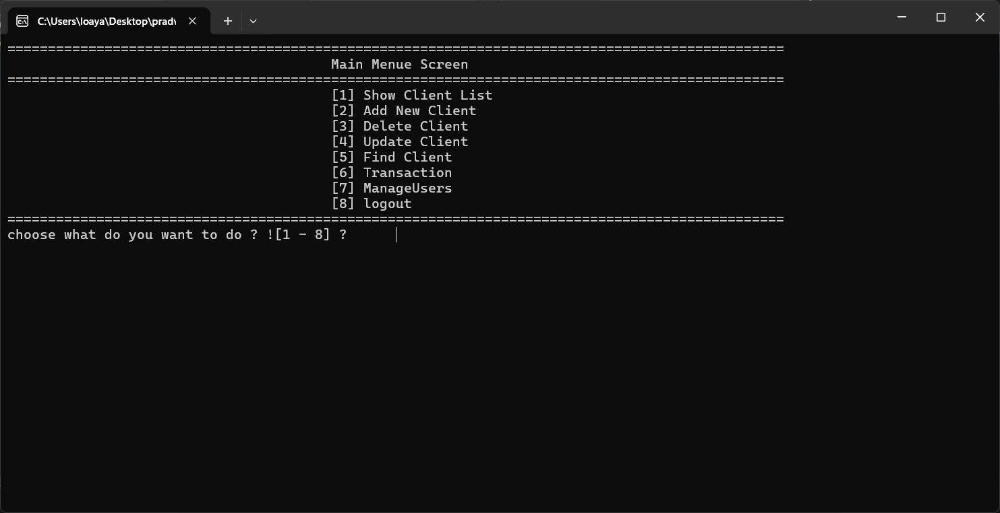
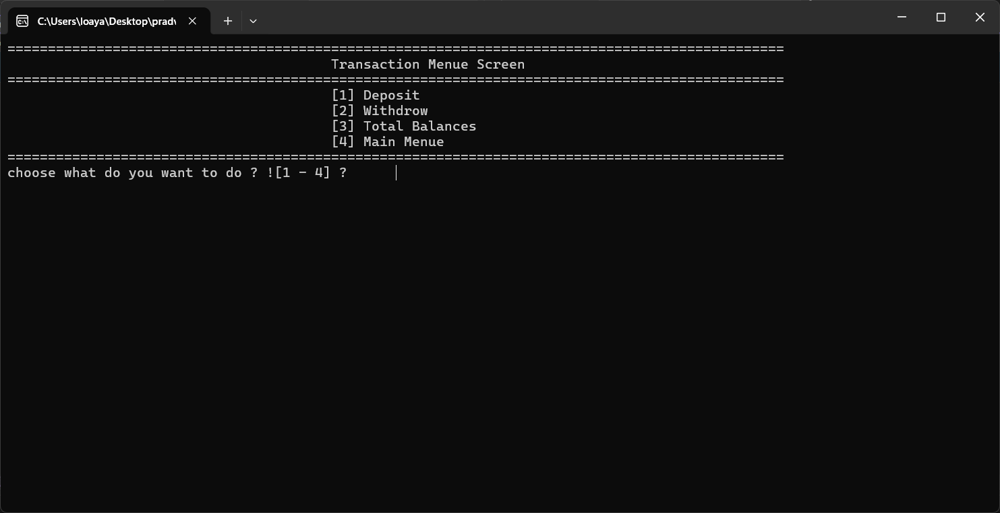
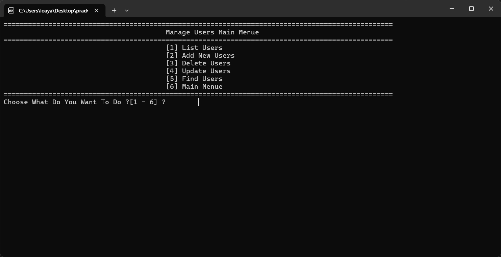
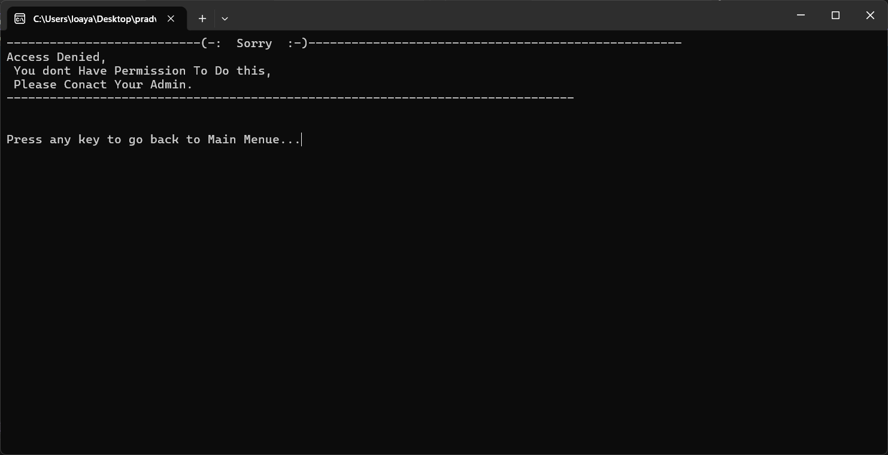

# Bank Project 🏦

A C++ banking management system implementing role-based permissions, a login system, and file-based data storage. This project focuses on clean architecture, separation of concerns, and simple persistent storage without a database.

---

## 📌 Table of Contents
- [Project Description](#project-description)
- [Key Features](#key-features)
- [What I Learned](#what-i-learned)
- [Technologies Used](#technologies-used)
- [Purpose](#purpose)
- [Screenshots](#screenshots)

---

## Project Description
This project demonstrates a compact bank management application written in C++ with the following core concepts:

- Role-based permission system (authorization) that controls what actions different users may perform.
- Login system that authenticates users and grants or denies access based on their permissions.
- File-based storage for clients, users, and transaction data (no external database required).
- Separation of concerns to keep authentication, business logic, and data access modular and maintainable.
- User interfaces (console or simple GUI) allowing authorized users to manage clients, perform transactions, and maintain system users.

---

## Key Features
- Add, search, and remove clients
- Perform account operations (deposit, withdraw, view balance/total)
- Manage application users (create, edit, delete, search)
- Permission checks that prevent unauthorized actions

---

## What I Learned
- Implementing role-based authorization and access control
- Designing and building a login/authentication flow
- Writing clean, modular, and readable C++ code
- Applying separation of concerns and organizing code for maintainability
- Handling file I/O for persistent storage without a database
- Designing simple user management and transaction workflows

---

## Technologies Used
- Programming language: C++
- Build tools: Standard C++ toolchain (`g++`, `clang++`, or equivalent)
- Version control: Git & GitHub
- Data storage: File-based storage (text or structured files)
- Standard libraries: `<fstream>`, `<iostream>`, `<vector>`, `<string>`, etc.

---

## Purpose
This project was created for learning and practice. It aims to:

- Develop a deeper understanding of au
# Bank Project 🏦

A C++ banking management system implementing role-based permissions, a login system, and file-based data storage. This project is focused on learning clean architecture, separation of concerns, and simple persistent storage without a database.

## Project Description
This project demonstrates a compact bank management application written in C++ with the following core concepts:

- Role-based permission system (authorization) that controls what actions different users may perform.
- Login system that authenticates users and grants or denies access based on their permissions.
- File-based storage for clients, users, and transaction data (no external database required).
- Separation of concerns in the codebase to keep authentication, business logic, and data access modular and maintainable.
- User interfaces (console or simple GUI) that let authorized users manage clients, perform transactions, and maintain system users.

Key features:
- Add, search, and remove clients
- Perform account operations (deposit, withdraw, view balance/total)
- Manage application users (create, edit, delete, search)
- Permission checks that prevent unauthorized actions

## What I Learned
Working on this project helped me practice and solidify the following skills:
- Implementing role-based authorization and access control
- Designing and building a login/authentication flow
- Writing clean, modular, and readable C++ code
- Applying separation of concerns and organizing code for maintainability
- Handling file I/O for persistent storage without a database
- Designing simple user management and transaction workflows

## Technologies Used
- Programming language: C++
- Build tools: Standard C++ toolchain (g++, clang++, or equivalent)
- Version control: Git & GitHub
- Data storage: File-based storage using the filesystem (text or structured files)
- Standard libraries: <fstream>, <iostream>, <vector>, <string>, etc.

## Purpose
This project was created for learning and practice. It is intended to:
- Help develop a deeper understanding of authorization, authentication, and application structure.
- Provide a hands-on exercise in organizing a C++ project with clear responsibilities.
- Serve as a starting point for extending to more advanced storage (e.g., databases) or a GUI in the future.

Note: This implementation is for educational purposes and not intended as a production-grade banking system.

## Screenshots
All image links are relative to the `PictureProject` folder.

### Login Screen
Hints for sample usernames and passwords are shown on the login screen to help testing.

---

### Main Screen
Shows the clients list and options to add, delete, or search for clients.

---

### Operations Screen
Perform financial operations such as deposit, withdrawal, and checking the total balance.

---

### User Management Screen
Manage system users: add, edit, delete, or search for users and control their permissions.

---

### Permissions Screen
Displayed when a user attempts to access functionality they are not authorized to use.

---

Developed by **Loay Anwar**